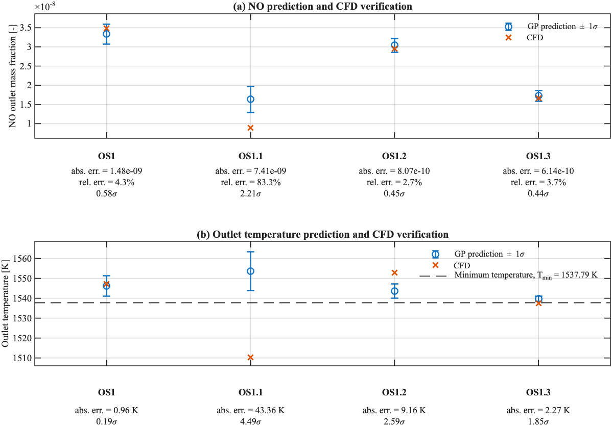
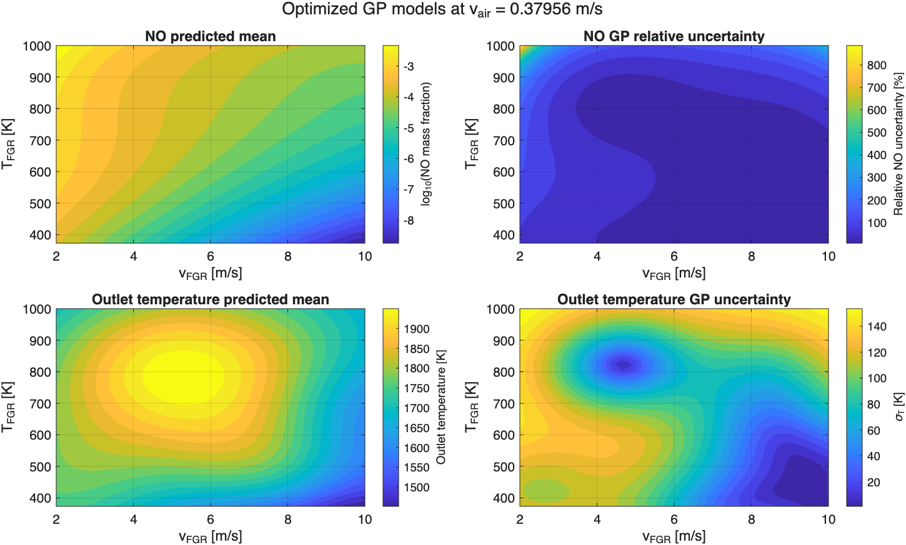

# Constrained Bayesian Optimization for CFD-Based NO Reduction

This repository contains the MATLAB implementation of the Bayesian Optimization (BO) part of a CFD project on methane combustion with Flue Gas Recirculation (FGR).

The CFD simulations were performed in ANSYS Fluent. Since evaluating new operating conditions requires a full CFD simulation, Gaussian Process (GP) surrogate models were used to approximate the system response and constrained Expected Improvement was used to select promising new simulation points.

The optimization objective was to reduce thermal NO emissions while maintaining a sufficiently high outlet temperature.

## Project context

The full project studied a steady-state, non-premixed methane-air combustion in a 2D axisymmetric combustor.

The CFD model included:

- SST k-ω turbulence model
- Eddy-Dissipation Model
- thermal and prompt NO formation
- Flue Gas Recirculation (FGR)

Introducing FGR already reduced NO emissions substantially compared with the original combustion case. The additional goal of the BO study was to determine whether the FGR operating conditions could be optimized further without reducing the outlet temperature below an acceptable level.

The full CFD project report is included in this repository:

[CFD report]

## Bayesian Optimization problem

Three operating parameters were optimized within the following design space:

| Variable | Description | Range |
|---|---|---:|
| `v_air` | Air inlet velocity | 0.35–0.65 m/s |
| `v_FGR` | FGR inlet velocity | 2.0–10.0 m/s |
| `T_FGR` | FGR inlet temperature | 373.15–1000 K |

The objective was to minimize the GP posterior mean of the outlet thermal NO concentration.

A probabilistic outlet-temperature constraint was imposed:

\[
P(T_{out} \geq 0.95 T_{baseline}) \geq 0.95
\]

where the baseline outlet temperature was approximately 1618.7 K.

Two separate Gaussian Process models were therefore fitted:

- one GP for outlet NO
- one GP for outlet temperature

The temperature GP is used both as a surrogate model and to calculate the probability that a candidate operating point satisfies the temperature constraint.

## Workflow

The optimization workflow was:

1. Generate an initial design of 9 samples using Sobol sampling.
2. Run the corresponding CFD simulations in ANSYS Fluent.
3. Fit GP surrogate models for outlet NO and outlet temperature.
4. Optimize the GP hyperparameters by maximizing the log marginal likelihood.
5. Use constrained Expected Improvement to select the next CFD operating point.
6. Run the new CFD simulation and add the result to the training data.
7. Refit the GP models and repeat the process.
8. Perform a final continuous constrained optimization of the GP surrogate.
9. Test the sensitivity of the optimum by training with two data points at higher outlet temperatures.
10. Verify the predicted optimum with three additional CFD simulations.

The initial GP fit used the FGR baseline case together with nine Sobol-sampled operating points. Nine additional CFD points were then selected sequentially using constrained Expected Improvement. The final GPs are fit without the points generated for sensitivity analysis. In total, the optimization and verification of the three-dimensional input space required 25 expensive CFD simulations.

## Gaussian Process models

The GP models use a squared-exponential covariance kernel.

The three optimization inputs are normalized to the interval `[0,1]` using the bounds of the design space, while the model outputs are standardized before GP fitting.

Outlet NO spans several orders of magnitude and must remain positive. It is therefore logarithmically transformed before standardization and GP regression.

The GP prediction is subsequently transformed back to physical units using the corresponding lognormal mean and variance transformations.

The GP hyperparameters are determined by maximizing the log marginal likelihood.

## Constrained Expected Improvement

Expected Improvement (EI) is used to balance exploitation of low predicted NO regions with exploration of regions where the GP uncertainty is still high.

Because the NO surrogate is fitted in logarithmic space, the acquisition function uses the corresponding Expected Improvement expression for a lognormally distributed physical NO prediction.

The temperature constraint is incorporated through the probability of feasibility:

\[
a(x) =
EI_{NO}(x)
P(T_{out}(x) \geq 0.95T_{baseline})
\]

512 candidate points are first generated using a Sobol sampling inside the design space. The best candidate locations are then used as starting points for continuous local optimization with MATLAB `fmincon`.

This combines global coverage of the three-dimensional design space with local continuous optimization.

## Results

The optimization identified a low-NO operating region with:

- low air inlet velocity
- high FGR flow
- moderate FGR inlet temperature

The lowest-NO CFD-verified final operating point satisfying the specified temperature constraint was:

| Parameter | Value |
|---|---:|
| `v_air` | 0.361 m/s |
| `v_FGR` | 9.54 m/s |
| `T_FGR` | 459 K |
| CFD outlet temperature | 1552.8 K |
| CFD thermal NO | 0.033 ppm |

The NO prediction at this point differed from the corresponding CFD result by approximately 2.7%.

The sequential validation also showed an important limitation of the surrogate model: some predicted optima had considerably larger temperature prediction errors. This motivated additional CFD verification and refitting rather than relying on the GP optimum alone.

The results also showed a clear trade-off between NO reduction and combustion conditions. Very low-NO regions were often associated with lower outlet temperatures and increased unburned methane. A useful extension of the optimization would therefore be to include an additional constraint on outlet methane concentration or combustion completeness.

## Repository structure

The MATLAB files are kept in a flat directory so that the complete workflow can be run directly without additional path configuration.

### Main workflow

`main.m`  
Runs the GP fitting, hyperparameter optimization, uncertainty visualization, constrained Expected Improvement, final constrained optimization and validation plots.

`CFD_Data.m`  
Contains the CFD operating conditions and corresponding outlet NO and temperature results used by the surrogate models.

### Gaussian Process regression

`GaussianProcessRegression.m`  
Computes the GP posterior mean and covariance.

`AssembleCovariance.m`  
Constructs the covariance matrices used by the GP.

`CalculateMarginalLikelihood.m`  
Calculates the GP marginal likelihood used for hyperparameter optimization.

### Bayesian Optimization

`expected_improvement_sampling.m`  
Implements constrained Expected Improvement, including the lognormal NO objective and probabilistic temperature constraint.

`find_constrained_optimum.m`  
Performs the final continuous constrained optimization of the fitted surrogate models.

`sobol_sampling.m`  
Generates Sobol samples in the normalized design space.

### Data transformations

`normalize.m` / `unnormalize.m`  
Transform the three optimization inputs between the physical and normalized design spaces.

`standardize.m` / `unstandardize.m`  
Standardize and recover GP output variables.

`lognormal_to_physical.m`  
Transforms the predicted log-NO Gaussian distribution back to physical NO mean and uncertainty.

### Evaluation and visualization

`visualize_training_data.m`  
Visualizes the CFD training data.

`visualize_uncertainty.m`  
Plots GP posterior means and uncertainties.

`gp_parity_metrics.m`  
Evaluates GP prediction performance.

`plot_optimum_validation.m`  
Compares GP predictions and uncertainty estimates against CFD verification simulations.

## Running the code

The code was developed in MATLAB.

Required functionality includes:

- Optimization Toolbox (`fmincon`)
- Statistics and Machine Learning Toolbox (`sobolset`, `normcdf`, `norminv`)

To run the complete workflow, place all `.m` files in the same directory and run MATLAB and `main.m`

## Project contribution

This work was completed as part of the TUM course project *CFD – Simulation for Energy Systems*.

The baseline CFD modelling, mesh study, NO formation analysis and FGR implementation were completed collaboratively as a group project.

The Bayesian Optimization extension was independently developed and implemented by me, including:

- Gaussian Process surrogate modelling for NO and outlet temperature
- formulation of the probabilistic temperature constraint
- constrained Expected Improvement
- sequential CFD sampling
- optimization of the FGR operating conditions
- CFD verification and refinement of the predicted optima

## Code provenance

Parts of the Gaussian Process implementation were developed and edited using the following exercise as an initial template:

> Solution to problem sheet on Gaussian Processes  
> Lecture: Probability Theory and Uncertainty Quantification  
> Technical University of Munich

The implementation was subsequently adapted to the CFD optimization problem, including output transformations, hyperparameter optimization, probabilistic constraints, constrained Expected Improvement, continuous acquisition optimization and CFD validation.

